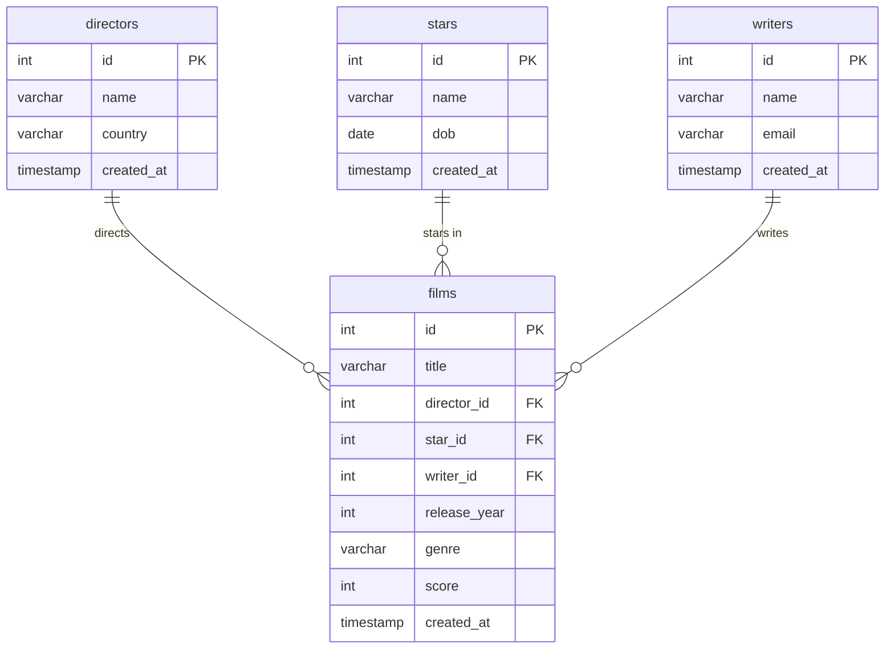
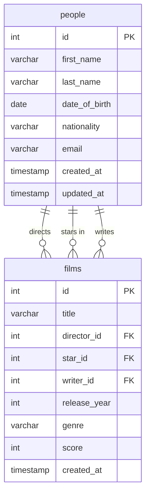

## Normalized Schema

Relationships (after normalisation):

- A **director** has many **films**; a film has exactly one director.
- A **star** appears in many **films**; a film has exactly one star (the lead).
- A **writer** writes many **films**; a film has exactly one writer.

The foreign keys therefore live on the **films** table (the "many" side) and each
points at the `id` primary key of the table it references.

### Table 1 - films

- id ---> int (PK)
- title ---> String
- director_id ---> int (FK ---> directors.id)
- star_id ---> int (FK ---> stars.id)
- writer_id ---> int (FK ---> writers.id)
- release_year ---> int
- genre ---> String
- score ---> int
- created_at ---> DateTime

### Table 2 - directors

- id ---> int (PK)
- name ---> String
- country ---> String
- created_at ---> DateTime

### Table 3 - stars

- id ---> int (PK)
- name ---> String
- dob ---> Date
- created_at ---> DateTime

### Table 4 - writers

- id ---> int (PK)
- name ---> String
- email ---> String
- created_at ---> DateTime

### ERD

---

## Extension Task 1 - single people table

`directors`, `stars` and `writers` are replaced by one `people` table. `films` keeps
three foreign key columns, but all three now point at **the same** parent table:

- `director_id` ---> people.id
- `star_id` ---> people.id
- `writer_id` ---> people.id

The role is expressed by *which column* the id sits in, not by which table it points
to. A person can therefore appear in more than one role on the same film without
being stored twice - `WHERE films.director_id = films.writer_id` finds exactly those.

30 role rows collapse into **26 people**: Lucas, Cameron, Angelopoulos and Kieslowski
each directed and wrote one of the films.

### Table - people

- id ---> int (PK)
- first_name ---> String
- last_name ---> String
- date_of_birth ---> Date (null for people whose DOB the source data does not give)
- nationality ---> String (was directors.country)
- email ---> String (was writers.email)
- created_at ---> DateTime
- updated_at ---> DateTime

### ERD

### Cost of the merge

`date_of_birth`, `nationality` and `email` are all nullable now, because the original
data only records one of them per person. That is the trade: one row per person, at
the price of a wider table with holes in it.
