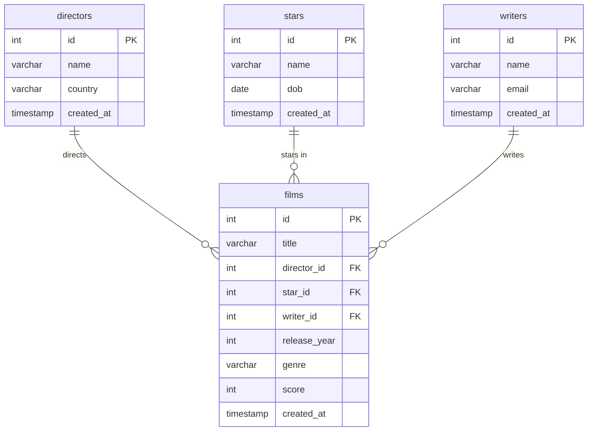

## Normalized Schema

Relationships (after normalisation):

- A **director** has many **films**; a film has exactly one director.
- A **star** appears in many **films**; a film has exactly one star (the lead).
- A **writer** writes many **films**; a film has exactly one writer.

The foreign keys therefore live on the **films** table (the "many" side) and each
points at the `id` primary key of the table it references.

### Table 1 - films

- id ---> int (PK)
- title ---> String
- director_id ---> int (FK ---> directors.id)
- star_id ---> int (FK ---> stars.id)
- writer_id ---> int (FK ---> writers.id)
- release_year ---> int
- genre ---> String
- score ---> int
- created_at ---> DateTime

### Table 2 - directors

- id ---> int (PK)
- name ---> String
- country ---> String
- created_at ---> DateTime

### Table 3 - stars

- id ---> int (PK)
- name ---> String
- dob ---> Date
- created_at ---> DateTime

### Table 4 - writers

- id ---> int (PK)
- name ---> String
- email ---> String
- created_at ---> DateTime

### ERD

